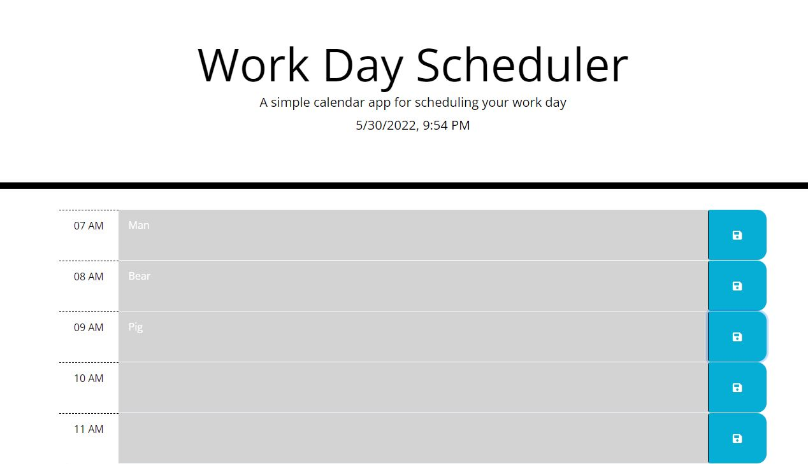

# Work Day Scheduler App

Link to deployed app: 

---

## Purpose
Project for UNC Charlotte Coding Bootcamp.
Basic HTML and CSS provided. Script.js file written by me.

This scheduler app was created to fit the following requirements outlined for the assignment:

---

## User Story
AS AN employee with a busy schedule

I WANT to add important events to a daily planner

SO THAT I can manage my time effectively

---

## MVP Criteria
GIVEN I am using a daily planner to create a schedule

WHEN I open the planner

THEN the current day is displayed at the top of the calendar

WHEN I scroll down

THEN I am presented with time blocks for standard business hours

WHEN I view the time blocks for that day

THEN each time block is color-coded to indicate whether it is in the past, present, or future

WHEN I click into a time block

THEN I can enter an event

WHEN I click the save button for that time block

THEN the text for that event is saved in local storage

WHEN I refresh the page

THEN the saved events persist

---

## Built With
* HTML
* CSS
* Bootstrap
* FontAwesome
* JavaScript
* JQuery
* Luxon